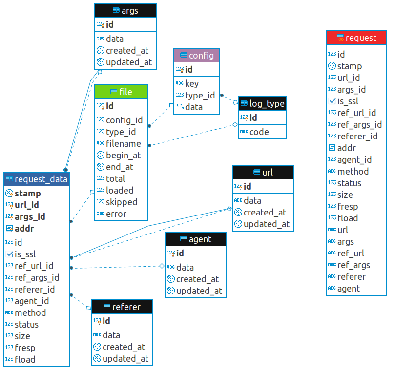

  English |
  <a href="README.ru.md#apisitelogbase">Pусский</a>

---

# apisite/logbase
> logfiles served via database

[![GoDoc][gd1]][gd2]
 [![GoCard][gc1]][gc2]
 [![GitHub Release][gr1]][gr2]
 [![GitHub code size in bytes][sz]]()
 [![GitHub license][gl1]][gl2]

[gd1]: https://godoc.org/github.com/apisite/logbase?status.svg
[gd2]: https://godoc.org/github.com/apisite/logbase
[gc1]: https://goreportcard.com/badge/github.com/apisite/tpl2x
[gc2]: https://goreportcard.com/report/github.com/apisite/logbase
[gr1]: https://img.shields.io/github/release-pre/apisite/logbase.svg
[gr2]: https://github.com/apisite/logbase/releases
[sz]: https://img.shields.io/github/languages/code-size/apisite/logbase.svg
[gl1]: https://img.shields.io/github/license/apisite/logbase.svg
[gl2]: LICENSE

**Project status:** WIP

## License

The MIT License (MIT), see [LICENSE](LICENSE).

Copyright (c) 2020 Aleksei Kovrizhkin <lekovr+logbase@gmail.com>
